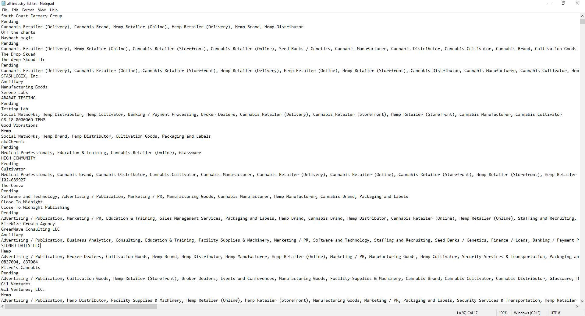
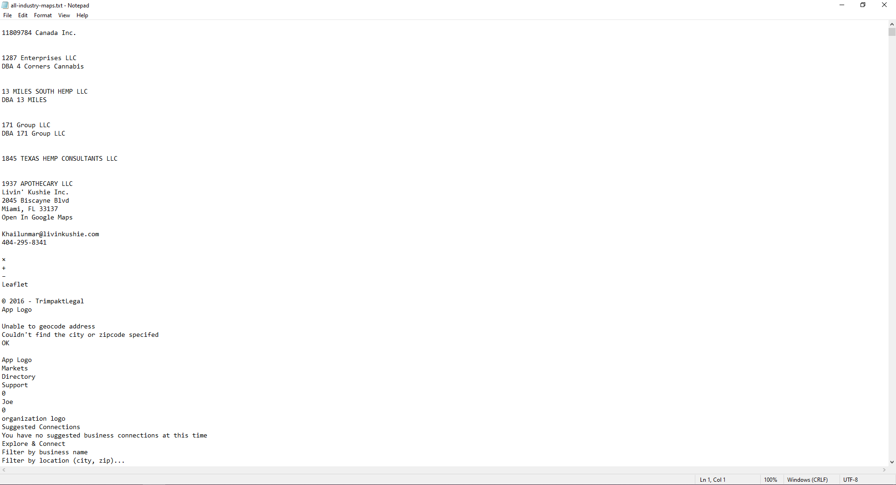
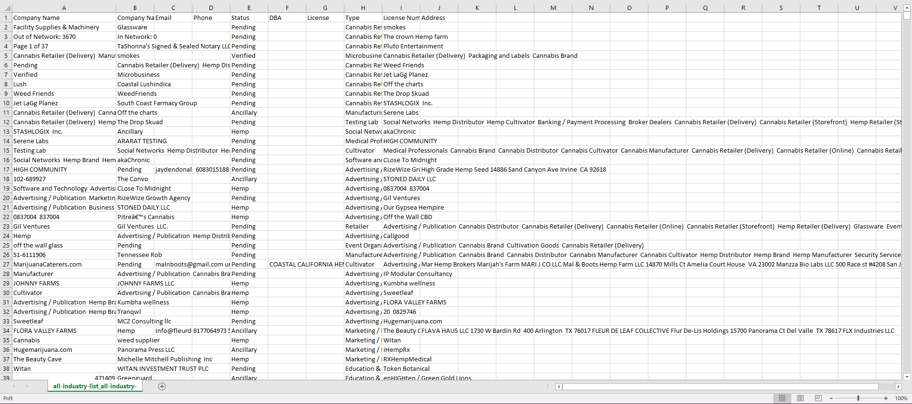

# 🎉 File Processing Script 🎉

## 🌟 Overview
This Python script 📜 transforms two text files (`all-industry-list.txt` 📋 and `all-industry-maps.txt` 🗺️) into a neat CSV file 📊. It grabs company details like names, statuses, and more, then matches them with extra info (emails 📧, phones 📞, addresses 🏠) to create a tidy output. 🚀

## ✨ Features
- 📥 Reads two text files with UTF-8 encoding.
- 🔍 Extracts company names (primary & secondary), status, type, and license number.
- 🔗 Matches company names with the maps file for additional details.
- 📤 Generates a CSV with columns: `Company Name`, `Company Name2`, `Email`, `Phone`, `Status`, `DBA`, `License`, `Type`, `License Number`, `Address`.
- 🗂️ Includes a state abbreviations dictionary (unused but included! 🌎).

## 🚀 How It Works
1. 📂 Opens and reads `all-industry-list.txt` and `all-industry-maps.txt`.
2. 🔎 Searches for statuses (`Pending`, `Hemp`, `Verified`, `Ancillary`) in the list file.
3. 📋 Captures company names and details above/below statuses.
4. 🗺️ Matches names in the maps file to add emails, phones, and addresses.
5. 📊 Writes all data to a CSV file named after the input files (e.g., `all-industry-list.txt + all-industry-maps.txt.csv`).
6. ✅ Prints the CSV file name when done! 🎉

## 📸 Screenshots
### 1. 📋 Input: `all-industry-list.txt`

- Shows company names and statuses (e.g., "11809784 Canada Inc.", "Pending").

### 2. 🗺️ Input: `all-industry-maps.txt`

- Displays company details with "Open In Google Maps" marker (e.g., "1937 APOTHECARY LLC", email, address).

### 3. 📊 Output: Generated CSV

- Resulting CSV with organized data (e.g., "Company Name", "Email", "Address").

## 🎮 Usage
1. 📥 Place `all-industry-list.txt` and `all-industry-maps.txt` in the same folder as the script.
2. ▶️ Run the script:
   ```bash
   python process_files.py
   ```
3. ✅ Check the generated CSV file! 📄

## ⚠️ Limitations
- 🔒 Hardcoded file paths (use `all-industry-list.txt` and `all-industry-maps.txt`).
- 🚫 No error handling for missing files or bad data.
- 📏 Limited to specific statuses and lookup ranges (10 lines up/down).

## 🌱 Future Improvements
- ➕ Add user input for file paths.
- 🛡️ Include error handling.
- 🔄 Use state abbreviations for addresses.
- 📈 Enhance regex for emails/phones.

## 🛠️ Dependencies
- 🐍 Python 3.x
- 📚 Libraries: `re`, `csv`

## 🎨 Visual Guide
- 📋 **List File** → 🔍 Search for statuses → 📋 Extract names/types.
- 🗺️ **Maps File** → 🔗 Match names → 📧 Add emails/phones/addresses.
- 📊 **CSV Output** → 🎉 Final organized data!

Happy coding! 😄